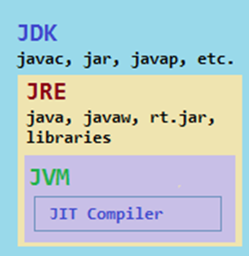

Java is a high level, class based, Object Oriented Programming language built by sun microsystems in 1995. It works on the principle of Write Once Run Anywhere (WORA).
Features of java:
1.	Simple
2.	Object oriented
3.	Secured
4.	Platform independent
5.	Robust
6.	Portable
7.	Multithreaded
8.	Distributed
9.	Interpreted
10.	High Performance
11.	Dynamic
12.	Architecture neutral

JDK (Java Development Kit): it consists of jre, jvm, javac, documentation etc.

JRE (Java Runtime Environment): it consists of prescribed methods, classes, and packages that are needed to run the programs.

JVM (Java Virtual Machine): it interprets the bytecode. 
 
The code is converted into bytecode by javac and then the bytecode is interpreted by the JVM to CPU. The Bytecode is not directly executed by the CPU.


 
### Memory Management in Java:
Java handles memory automatically through a process known as automatic memory management, mainly using Garbage Collection (GC) to free up unused memory.

**_Java Memory Areas (Memory Model):_** when a java program runs, memory is divided into the following main areas:

**_Heap:_** Stores objects and instance variables. Managed by the garbage collector.

**_Stack:_** Stores method calls and local variables. Each method / thread has its own stack.

**_Method Area:_** Stores class-level metadata (class name, static variables, method info). Code is loaded into method area.

---
#### Types of variables in java:
1.	Local Variables: Local variables are a variable that are declared inside the body of a method.
2.	Instance / non-static variables: variable declared inside the class but outside the body of the method, is called an instance variable.
3.	Class / Static variables: Static variables are initialized only once, at the start of the program execution.
Class Demo {
	Static int a = 1; // static variable
	Int data = 99; 	// instance variable
	void method () {
	int b = 90; // local variable.
}
}

### Data Types:
Primitive data types are predefined and available within the java language. which include integer, character, Boolean, and float. \
Total 8 Types:


Byte	1 bit\
Short 	2 bit\
Int 	4 bit\
Long 	2 bit\
Char 	2 bit\
Float 	4 bit\
Double 	8 bit\
Boolean	1 bit

**_Non-Primitive data types_**: which include classes, arrays, and interfaces.
Type conversion and Type casting:

Case 1: Variable of smaller capacity is assigned to another variable of bigger capacity. \

``` java
Double d;
Int i = 10;
d = I;
```
This process is automatic, and non-explicit is known as conversion.

Case 2: Variable of larger capacity is assigned to another variable of smaller capacity.
```java
	Double d = 10;
	Int I;
	I = (int) d; 	[(int) -> Type cast operator]
```
You must specify the Type Cast Operator. This process is called Type casting.

**_There are a Total of 51 reserved keywords in java._**

Control Flow:
If Statements:
1.	Simple if statement
2.	if-else statement
3.	if-else-if ladder
4.	Nested if-statement

```java 
If(condition) {
	// code
If(condition) {
		// nested if 
// code
}
} else if (condition) {
	// code
} else {
	// code
}
```

Switch Statement:

```java 
Switch(val){
	case value1:	// code
			break;
	case value2: 	// code
			break;
	default: 	// code
}
```

### Methods:
Methods in Java: A method is a block of code or collection of statements to perform a certain task or operation.

**Access Specifier:** visibility of the method.
1.	**Public:** The method is accessible by all classes.

2.	**Private:** the method is accessible only in the class in which it is defined.
3.	**Protected:** the method is accessible within the same package or subclasses in a different package.
4.	**Default:** when we don’t use any access specifier, java uses default access specifier by default. It is visible only from the same package.

**Types of Methods:** 
Predefined methods: methods that are already defined in the java class libraries are known as predefined methods. Also known as the built-in method.
```
Ex: length(), equals(), compareTo(), sqrt().
```
**User-defined methods:** The method written by user or programmer is known as a user-defined method.

**Static method:** A static method belongs to the class, not to any specific object. It can be called without creating an object of the class. 

```java 
Static int add(int a, int b) {}
```

**Instance method:** An instance method is a method that belongs to an object of a class. It can access instance variables and other instance methods of the class.

**Abstract Method:** the method does not have the method body in known as abstract method. In other words, without implementation is known as an abstract method. The class itself must be abstract if it has an abstract method.

**Final Method:** Cannot be overridden by subclasses. Useful to prevent modification.

**Constructors:** a constructor is a block of code like the method without a return type. It is called when the instance of the class is created. It has the same name as class.

1.	**Default Constructor:** A Constructor with no parameters. Java will create one automatically if not created by user.

2.	**Parameterized Constructor:** A constructor that takes arguments to initialize object values.

3.	**Constructor Overlading:** Multiple constructors with different parameters in the same class.

Constructors can be overloaded with different parameters. Constructors cannot be overridden.

**Copy constructor:**

**_this() in constructor: Calls another constructor in same class._**

**_super() in constructor: Calls parent class constructor (in inheritance)._**

___
## STRINGS:
**What are Strings?**

Strings are nothing but a sequence of characters enclosed within double quotes.

**How are Strings represented in Java?**

In some other languages the strings are represented as an array of characters. But in case of java, Strings are represented as objects of **_java.lang.String_** class.

**How do you create Strings in java?**

There are two ways to create String objects in java.
1. Using String literals
	```java 
	String s1 = “ABC”;
	String s2 = “123”;
	```
2. Using new Operator ```java String s3 = new String(“user”);```

### STRING POOL:

The String Pool (also called the intern pool) is a special memory area in the Heap where Java stores string literals to optimize memory usage and improve performance.

#### Why String pool Exist?

•	Strings are used frequently in most Java applications.

•	Strings are immutable (cannot be changed once created).

•	Reusing the same string objects saves memory and boosts performance.
Both a and b refer to the same object in the String Pool — no new object is created for b. 
 
A new object is created in the Heap, not reused from the pool. Even though the value is the same, it’s a different object. 
 
```java 
a == b: true (same reference)
a == c: false (different objects)
```
---
### EXCEPTION HANDLING:
Exception is an unwanted event that interrupts the normal flow of the program.

Types of exceptions:
1.	**Checked exceptions:** that are checked at the compile-time.

2.	**Unchecked exceptions:** not checked at the compile-time but they are checked at the runtime.

**Try:** The try keyword is used to specify a block where we should place an exception code.

**Catch:** The catch block contains code that is executed when the exception handler is invoked.

**Finally:** The finally block contains code that is executed whether the exception occurs or not.

**Throw:** throw keyword is used to declare an exception explicitly.

**Throws:** The throws keyword is used in a method declaration to declare one or more exceptions that the method might throw during execution.

**_TRY is mandatory, CATCH is also mandatory if NO FINALLY, finally is optional if both try and catch are present finally is mandatory if no catch in present._**

Common Java Exception:

1.	**ArithmeticException:** if we divide any number with zero.

```java
Int a = 50/0;
```
2.	**NullPointerException:** if we have null value in any variable.

```java
String s = null;
Sout(s.length()); //NullPointerException
```
3.	**NumberFormatException:** if any variable or number is mismatched.

```java
String s="abc"; 
Int i= Integer.parseInt(s); 
```
4.	**ArrayIndexOutOfBoundsException:**

Java interview questions:
1.	Can we use final keyword for class? Explain why and how?
